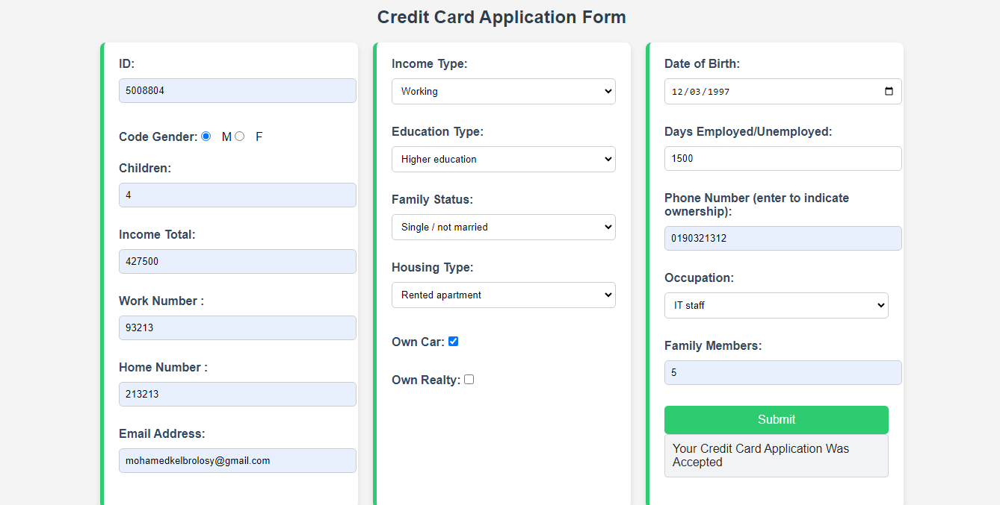

# Applicant Credit Risk Prediction

This project provides an application for predicting the credit risk of applicants. It allows banks and financial institutions to make informed decisions about issuing credit cards by analyzing various features of an applicant, such as income, credit score, loan amount, and more. The backend utilizes a Random Forest model for predictions and returns a risk assessment to the frontend.



## Features

- **Credit Risk Prediction**: The app predicts the risk level associated with a credit card applicant based on multiple factors like income, credit score, and loan amount.
- **Backend Model**: A Random Forest model is used for prediction. It has been trained on real-world data and has shown high accuracy in determining whether an applicant is a low or high risk.
- **Data-Driven Decisions**: The prediction helps banks and financial institutions make decisions about issuing credit cards to applicants.
- **Dockerized Backend and Frontend**: The project uses Docker to containerize both the backend and frontend, and Docker Compose to run them together.

## Technologies Used

- **Backend**: Flask, Random Forest (scikit-learn)
- **Frontend**: HTML, CSS, JavaScript (with Fetch API)
- **Containerization**: Docker, Docker Compose
- **Machine Learning**: Logitic Regression,Neural Network, Random Forest Model (scikit-learn)
- **API Communication**: JSON

## Accuracy of the Model

The Random Forest model used in this application has been trained using a dataset of applicants' financial data. The model achieves **92% accuracy** in classifying applicants as low or high risk based on the features provided.

---

## Repo Structure

### **Backend (`backend/` folder)**

- **`app.py`**: The main Flask application file that handles HTTP requests for predictions.
- **`model/`**: Contains the Random Forest model and any related code for model training and evaluation.
- **`analysis/`**: Contains exploratory data analysis (EDA) files and scripts for data processing.
- **`Dockerfile`**: A Dockerfile to containerize the backend service.
- **`requirements.txt`**: The required Python libraries for the backend (Flask, scikit-learn, etc.).

### **Frontend (`frontend/` folder)**

- **`index.html`**: The HTML file containing the form where users can input applicant details and interact with the Backend.
- **`Dockerfile`**: A Dockerfile to containerize the frontend service.

### **Root Files**

- **`Credit_Card_Approval_Analysis.ipynb`**: The Jupyter Notebook contains the Complete EDA and Feature Engineering Modeling of The Credit Card Risk analysis Problem.
- **`docker-compose.yml`**: The Docker Compose file that defines the services (backend and frontend) and manages their interaction.

---

## Setup Instructions

### 1. Clone the Repository
Clone this repository to your local machine:

```bash
git clone https://github.com/muhammed1k/Credit_Card_Approval_Analysis.git
cd applicant-credit-risk-prediction
```

#### 2. **Running The Notebook**
1. install requirements
```bash
   pip install requirements.txt
   ```
2. run jupyter notebook
```bash
    install python
    pip install jupyter-notebook
    use jupyter Notebooks Server to load and run the notebook cells
   ```
#### 3. **Running python Files Without Docker**
1. install requirements
```bash
   pip install requirements.txt
   ```
2. run in cmd commands
```bash
   cd backend
   python main.py
   ```
```bash
   cd frontend
   python -m http.server 3000
   ```
4. **Run Locally**  
   Visit the following:
   - Backend API: `http://localhost:9897`
   - Frontend: `http://localhost:3000`

#### 4. **Running with Docker Compose**

1. **Install Docker & Docker Compose**  
   Ensure Docker and Docker Compose are installed.

2. **Setup Docker Containers**  
   Use Docker Compose to build the backend and frontend services:
   ```bash
   docker compose up --build
   ```

3. **Run Locally**  
   Visit the following:
   - Backend API: `http://localhost:9897`
   - Frontend: `http://localhost:3000`

## Usage
1. **Access the Web Interface**  
   Go to `http://localhost:3000` to use the Credit Card Risk Prediction Tool.

2. **Translate Sentences**  
   Input Applicant Details and click **Submit** to see the predicted Risk.

### 3. API Endpoints

- **POST `/predict_risk`**: Takes in applicant data in JSON format and returns the credit risk prediction. Example JSON body:

```json
{"ID":5008804,"CODE_GENDER":"F","FLAG_OWN_CAR":"N","FLAG_OWN_REALTY":"Y","CNT_CHILDREN":0,"AMT_INCOME_TOTAL":121500.0,"NAME_INCOME_TYPE":"Working","NAME_EDUCATION_TYPE":"Secondary / secondary special","NAME_FAMILY_STATUS":"Married","NAME_HOUSING_TYPE":"House / apartment","DAYS_BIRTH":-18858,"DAYS_EMPLOYED":-1201,"FLAG_MOBIL":1,"FLAG_WORK_PHONE":0,"FLAG_PHONE":1,"FLAG_EMAIL":0,"OCCUPATION_TYPE":"Sales staff","CNT_FAM_MEMBERS":2.0}
```

**Response**:

```json
{
    "status": "Your Credit Card Application Was Approved",
    "risk_level": "Applicant is Low Risk with Probability of 0.92"
}
```

---

## Features for Banks

This system helps banks and financial institutions assess the risk level of credit card applicants. Based on the applicant's input data, the system outputs a prediction of whether the applicant is a low or high risk for approval. The bank can then decide whether to approve or reject the credit card application.

---

## Demo

A live demo of this application will be added soon. The demo will showcase how users can input data into the form, receive a risk level prediction, and understand how the model's prediction is made.

---